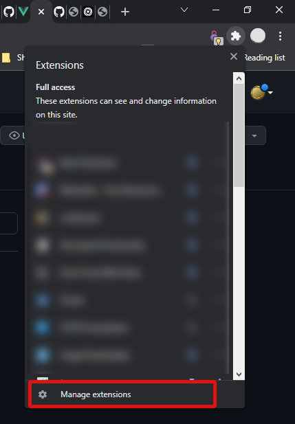

# Installation

<Note type="danger">

If you are currently using the Beta Safety Chrome extension, ***disable it first***. Do not attempt to run both Beta Safety and Beta Protection extensions at once. Bad things will happen.

</Note>

Beta Protection currently supports Chrome and Edge and _should_ work on any other Chrome derivatives (like Vivaldi). The extension actually _would_ support Firefox but Mozilla [still](https://blog.mozilla.org/addons/2021/05/27/manifest-v3-update/) don't support the latest version of the browser API that this extension relies on.

## Prerequisites

First off, make sure you have Beta Safety running somewhere. Follow the guides included with Beta Safety to run the backend, but you can ignore the parts about loading the extension into Chrome since we'll be using Beta Protection for that part.

> Since Beta Protection allows you to customize where your backend is running, you could actually run the backend on another PC entirely, if you wanted to.

## Download

Download the extension package from the [GitHub Releases](https://github.com/silveredgold/beta-protection/releases) page. You should download the **beta-protection.crx** file from the Release, _not_ the ZIP file. Open the folder where you downloaded the CRX file, for later on.

## Installation

In Chrome, click the Extensions button in your browser toolbar (the puzzle piece) and click the Manage Extensions button at the bottom of the menu.

<!--  -->
<ImageZoom 
  src="/beta-protection/assets/chrome_manage_extensions.jpg" 
  :border="true" 
  width="200"
/>

Ensure the Developer mode toggle at the top-right of the page is enabled and you should see a few extra buttons at the top left of the page.

Finally, drag and drop the CRX file you downloaded in the last step into the Extensions window in Chrome. Chrome should prompt you to install Beta Protection, so accept the prompt and Beta Protection should appear in your Extensions list!

### Troubleshooting

#### *This extension is not listed in the (...) Store* error

If you see an error message similar to the below, your browser is blocking extension packages not from an approved Web Store from loading. The easiest way to avoid this is to load the extension "unpacked" (this is how Beta Safety installs, if you're more familiar with that).

1. Download the ZIP file from the GitHub Releases page (rather than the `.crx` file), and extract it somewhere
2. From your browser's Manage Extensions page (with Developer Mode on), find the *Load Unpacked* option
3. Click it, and select the folder where you unpacked the ZIP file. Beta Protection should appear in your Extensions list.